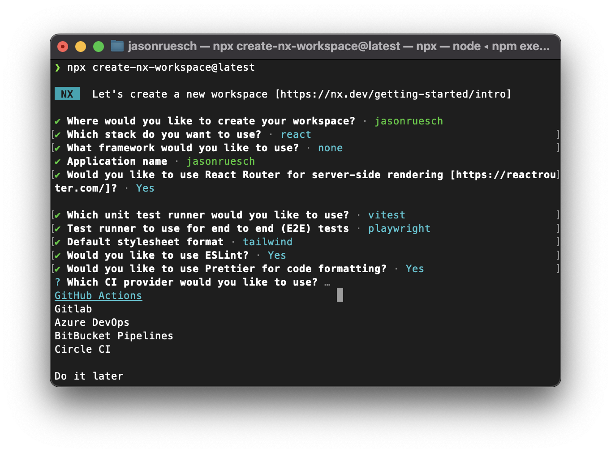

# Table of Contents

1. [Nx](#nx)
1. [Tailwind CSS 4 and tailwind-merge](#tailwind-css-4-and-tailwind-merge)
1. [Husky](#husky)
1. [Lint-Staged](#lint-staged)
1. [Conventional Commits and Commitlint](#conventional-commits-and-commitlint)
1. [Commitizen](#commitizen)
1. [Google Analytics](#google-analytics)
1. [Docker](#docker)
1. [Nx Release](#nx-release)
1. [Fly.io Deployment](#flyio-deployment)
1. [GitHub Actions](#github-actions)
1. [Other Tools](#other-tools)


<div id="nx"></div>

## [Nx](https://nx.dev/)

```bash
npx create-nx-workspace@latest
```

Select the following options:




<div id="tailwind-css-4-and-tailwind-merge"></div>

## [Tailwind CSS 4](https://tailwindcss.com/) and [tailwind-merge](https://github.com/dcastil/tailwind-merge)

```bash
npm uninstall -D tailwindcss postcss autoprefixer
npm install tailwindcss@latest
cd apps/jasonruesch
npx @tailwindcss/upgrade -f
rm -rf postcss.config.js tailwind.config.js
cd ../../
npm install -D @tailwindcss/vite
npm install -D prettier@latest prettier-plugin-tailwindcss
npm install -D tailwind-merge
```

Update [apps/jasonruesch/vite.config.ts](../apps/jasonruesch/vite.config.ts) with the following:

```typescript
import tailwindcss from '@tailwindcss/vite';

export default defineConfig({
  ...
  plugins: [
    ...
    tailwindcss(),
  ],
  ...
});
```

Update [apps/jasonruesch/styles.css](../apps/jasonruesch/styles.css) with the following:

```css
@import 'tailwindcss';
```

Update [apps/jasonruesch/app/root.tsx](../apps/jasonruesch/app/root.tsx) with the following:

```typescript
...
import '../styles.css';
...
```

Update [.prettierrc](../.prettierrc) with the following:

```json
{
  ...
  "plugins": ["prettier-plugin-tailwindcss"]
}
```


<div id="husky"></div>

## [Husky](https://typicode.github.io/husky/)

```bash
npx husky-init && npm install
npx husky add .husky/commit-msg ''
npx husky add .husky/prepare-commit-msg ''
```


<div id="lint-staged"></div>

## [Lint-Staged](https://github.com/lint-staged/lint-staged)

```bash
npm install -D lint-staged
```

Create [.lintstagedrc.js](../.lintstagedrc.js) with the following:

```typescript
export default {
  '*.{ts,tsx,js,jsx}': ['nx affected -t lint --uncommitted --fix'],
  '*': ['nx format:write --base=main --head=HEAD'],
};
```

Update [.husky/pre-commit](../.husky/pre-commit) with the following:

```bash
#!/usr/bin/env sh
. "$(dirname -- "$0")/_/husky.sh"

npx lint-staged
```


<div id="conventional-commits-and-commitlint"></div>

## [Conventional Commits](https://www.conventionalcommits.org/) and [Commitlint](https://commitlint.js.org/)

```bash
npm install -D @commitlint/config-nx-scopes @commitlint/cli @commitlint/config-conventional
```

Create [commitlint.config.js](../commitlint.config.js) with the following:

```typescript
async function getConfig() {
  const {
    default: {
      utils: { getProjects },
    },
  } = await import('@commitlint/config-nx-scopes');

  return {
    rules: {
      'scope-enum': async (ctx) => [
        2,
        'always',
        [
          ...(await getProjects(ctx, ({ name }) => !name.includes('e2e'))),
          'repo',
          'release',
        ],
      ],
    },
  };
}

module.exports = getConfig();
```

Update [.husky/commit-msg](../.husky/commit-msg) with the following:

```bash
#!/usr/bin/env sh
. "$(dirname -- "$0")/_/husky.sh"

npx --no-install commitlint -V --edit "$1"
```


<div id="commitizen"></div>

## [Commitizen](https://commitizen-tools.github.io/commitizen/)

```bash
npm install -D commitizen @commitlint/cz-commitlint
```

Create [cz-adapter.cjs](../cz-adapter.cjs) with the following:

```typescript
exports.prompter = async (inquirerIns, commit) => {
  (await import('@commitlint/cz-commitlint')).prompter(inquirerIns, commit);
};
```

> Note: The `cz-adapter.cjs` file is required to use the `@commitlint/cz-commitlint` with ESM.

Update [package.json](../package.json) with the following:

```json
"config": {
  "commitizen": {
    "path": "./cz-adapter.cjs"
  }
}
```

Update [.husky/prepare-commit-msg](../.husky/prepare-commit-msg) with the following:

```bash
#!/usr/bin/env sh
. "$(dirname -- "$0")/_/husky.sh"

# $2 contains the source of the commit message.
# It can be message, template, merge, squash, or commit (for git commit --amend)
if [ "$2" = "commit" ]; then
  echo "Skipping prepare-commit-msg hook due to amend."
  exit 0
elif [ "$2" = "message" ]; then
  echo "Skipping prepare-commit-msg hook due to message already provided."
  exit 0
fi

# If we're in the middle of an interactive rebase, GIT_SEQUENCE_EDITOR will be set.
# We'll skip the hook in this case as well.
if [ -n "$GIT_SEQUENCE_EDITOR" ]; then
  echo "Skipping prepare-commit-msg hook due to rebase."
  exit 0
fi

# Require Commitizen prompt for all branches, especially feature branches.
(exec < /dev/tty && node_modules/.bin/cz --hook) || true < /dev/null
```


<div id="google-analytics"></div>

## [Google Analytics](https://analytics.google.com/)

```bash
npm install react-ga4
```

Create [apps/jasonruesch/.env.example](../apps/jasonruesch/.env.example) with the following:

```env
VITE_GA_MEASUREMENT_ID=G-XXXXXXXXXX
```

If desired, copy `.env.example` to `.env.local` and replace `G-XXXXXXXXXX` with your Google Analytics Measurement ID.

```bash
cp apps/jasonruesch/.env.example apps/jasonruesch/.env.local
```

Update [apps/jasonruesch/app/app.tsx](../apps/jasonruesch/app/app.tsx) with the following:

```typescript
import ReactGA from 'react-ga4';

export function App() {
  const measurementId = import.meta.env.VITE_GA_MEASUREMENT_ID;
  if (measurementId) ReactGA.initialize(measurementId);
  ...
}
```

Create [scripts/cp-dep.sh](../scripts/cp-dep.sh) with the following to copy a dependency from `package.json` to another file:

```bash
#!/usr/bin/env bash

pkg="$1"
source="$2"
target="$3"
section="${4:-dependencies}" # or devDependencies

version=$(jq -r --arg pkg "$pkg" '.dependencies[$pkg] // .devDependencies[$pkg]' "$source")

if [ "$version" != "null" ]; then
  jq --arg pkg "$pkg" --arg version "$version" \
      ".$section[\$pkg] = \$version" "$target" > "$target.tmp" && mv "$target.tmp" "$target"
  echo "✅ Updated $pkg@$version in $target"
else
  echo "❌ Package $pkg not found in $source"
fi
```

Run the script to copy the `react-ga4` dependency from `package.json` to `apps/jasonruesch/package.json`:

```bash
bash scripts/cp-dep.sh react-ga4 package.json apps/jasonruesch/package.json
```


<div id="docker"></div>

## [Docker](https://www.docker.com/)

Create [apps/jasonruesch/Dockerfile](../apps/jasonruesch/Dockerfile) with the following:

```dockerfile
# syntax = docker/dockerfile:1

# Adjust NODE_VERSION as desired
ARG NODE_VERSION=23.6.0
FROM node:${NODE_VERSION}-slim AS base

LABEL fly_launch_runtime="Node.js"

# Node.js app lives here
WORKDIR /app


# Throw-away build stage to reduce size of final image
FROM base AS build

# Install node modules
COPY --link package-lock.json package.json ./
RUN npm ci --ignore-scripts

# Copy application code
COPY --link . .
RUN npx nx build jasonruesch


# Final stage for app image
FROM base

# Copy built application
COPY --from=build /app/apps/jasonruesch/package.json /app
COPY --from=build /app/apps/jasonruesch/build /app/build
RUN npm install --omit=dev

# Set production environment
ENV NODE_ENV="production"

# Start the server by default, this can be overwritten at runtime
EXPOSE 3000
CMD [ "npx", "react-router-serve", "build/server/index.js" ]
```

Update [apps/jasonruesch/package.json](../apps/jasonruesch/package.json) with the following:

```json
{
  ...
  "nx": {
    "targets": {
      "docker-build": {
        "dependsOn": [
          "build"
        ],
        "command": "docker build -f apps/jasonruesch/Dockerfile . -t jasonruesch"
      }
    }
  }
}
```

<!--
Create `docker-compose.yml` with the following:

```yaml
version: '3'

services:
  jasonruesch:
    image: jasonruesch:latest
    container_name: jasonruesch
    build:
      context: .
      dockerfile: ./apps/jasonruesch/Dockerfile
    ports:
      - '3000:3000'
    volumes:
      - .:/app
      - /app/node_modules
    environment:
      - CHOKIDAR_USEPOLLING=true # To fix an issue with HMR on Windows machines
```
-->


<div id="nx-release"></div>

## Nx Release

Update [nx.json](../nx.json) with the following:

```json
{
  ...
  "release": {
    "projects": ["jasonruesch"],
    "version": {
      "conventionalCommits": true
    },
    "changelog": {
      "workspaceChangelog": {
        "createRelease": "github"
      }
    }
  }
}
```

Then, tag the current commit with the first version number:

```bash
git tag v0.0.1
git push origin v0.0.1
```


<div id="flyio-deployment"></div>

## [Fly.io Deployment](https://fly.io/)

```bash
brew install flyctl
flyctl auth login
flyctl launch --no-deploy
mv fly.toml apps/jasonruesch/
rm -rf Dockerfile
rm -rf .github/workflows/ci.yml .github/workflows/fly-deploy.yml
```

Update [apps/jasonruesch/fly.toml](../apps/jasonruesch/fly.toml) with the following:

```toml
[build]
  dockerfile = './Dockerfile'

[env]
  PORT = '3000'

[http_service]
  internal_port = 3000
```

Update [apps/jasonruesch/package.json](../apps/jasonruesch/package.json) with the following:

```json
{
  ...
  "nx": {
    "targets": {
      ...
      "deploy": {
        "command": "flyctl deploy --config apps/jasonruesch/fly.toml"
      }
    }
  }
}
```

Deploy initial version:

```bash
npx nx deploy jasonruesch
```


<div id="github-actions"></div>

## [GitHub Actions](https://github.com/features/actions)

Create [.github/labeler.yml](../.github/labeler.yml) with the following:

```yaml
# Single quotes are required for leading asterisks

# Changes to files in the root folder
root:
  - changed-files:
      - any-glob-to-any-file: '*'

# Changes to files in the .github/workflows folder
ci:
  - changed-files:
      - any-glob-to-any-file: .github/workflows/**

# Changes within 'docs' folder and subfolders, or markdown files
documentation:
  - changed-files:
      - any-glob-to-any-file: docs/**
      - any-glob-to-any-file: '**/*.md'

# Changes to files in the apps folder
apps:
  - changed-files:
      - any-glob-to-any-file: apps/**

# PR is opened against the main branch
release:
  - base-branch: 'main'

# Changes to files in any jasonruesch folder
jasonruesch:
  - changed-files:
      - any-glob-to-any-file: '**/jasonruesch/**'
```

Create [.github/labels.yml](../.github/labels.yml) with the following:

```yaml
- name: root
  color: 'b60205'
  description: 'Changes to files in the root folder'

- name: ci
  color: 'd93f0b'
  description: 'Changes to files in the .github/workflows folder'

- name: documentation
  color: 'fbca04'
  description: 'Changes within docs folder and subfolders, or markdown files'

- name: apps
  color: '0e8a16'
  description: 'Changes to files in the apps folder'

- name: release
  color: '006b75'
  description: 'PR is opened against the main branch'

- name: jasonruesch
  color: '1d76db'
  description: 'Changes to files in any jasonruesch folder'
```

Create [.github/workflows/labeler.yml](../.github/workflows/labeler.yml) with the following:

```yaml
# This workflow will triage pull requests and apply a label based on the
# paths that are modified in the pull request.
#
# To use this workflow, you will need to set up a .github/labeler.yml
# file with configuration.  For more information, see:
# https://github.com/actions/labeler

name: Labeler

on:
  - pull_request_target

jobs:
  labeler:
    name: Assign Labels
    runs-on: ubuntu-latest
    permissions:
      contents: read
      pull-requests: write
    steps:
      - uses: actions/labeler@v5
        with:
          sync-labels: true
```

Create [.github/workflows/labels.yml](../.github/workflows/labels.yml) with the following:

```yaml
# Default color paletter of GitHub labels:
# https://gist.github.com/borekb/d61cdc45f0c92606a92b15388cf80185
# b60205
# d93f0b
# fbca04
# 0e8a16
# 006b75
# 1d76db
# 0052cc
# 5319e7
# e99695
# f9d0c4
# fef2c0
# c2e0c6
# bfdadc
# c5def5
# bfd4f2
# d4c5f9

name: Labels

on:
  push:
    branches:
      - main
    paths:
      - .github/labels.yml
      - .github/workflows/labels.yml

  workflow_dispatch:

jobs:
  sync:
    name: Sync Labels
    runs-on: ubuntu-latest
    steps:
      - uses: actions/checkout@v4
        with:
          sparse-checkout: .github/labels.yml

      - uses: EndBug/label-sync@v2
        with:
          config-file: '.github/labels.yml'
          delete-other-labels: true
```

Create [.github/workflows/staging.yml](../.github/workflows/staging.yml) with the following:

```yaml
name: Staging

on:
  push:
    branches:
      - main

  # Allows you to run this workflow manually from the Actions tab
  workflow_dispatch:

permissions:
  actions: read
  contents: read

jobs:
  main:
    runs-on: ubuntu-latest
    outputs:
      affected_build_jasonruesch: ${{ steps.affected_build_jasonruesch.outputs.projects }}
    steps:
      - uses: actions/checkout@v4
        with:
          filter: tree:0
          fetch-depth: 0

      # This enables task distribution via Nx Cloud
      # Run this command as early as possible, before dependencies are installed
      # Learn more at https://nx.dev/ci/reference/nx-cloud-cli#npx-nxcloud-startcirun
      # Uncomment this line to enable task distribution
      # - run: npx nx-cloud start-ci-run --distribute-on="3 linux-medium-js" --stop-agents-after="e2e-ci"

      # Cache node_modules
      - uses: actions/setup-node@v4
        with:
          node-version: 20
          cache: 'npm'

      - run: npm ci --legacy-peer-deps --ignore-scripts
      # - run: npx playwright install --with-deps
      - uses: nrwl/nx-set-shas@v4

      # Prepend any command with "nx-cloud record --" to record its logs to Nx Cloud
      # - run: npx nx-cloud record -- echo Hello World
      # Nx Affected runs only tasks affected by the changes in this PR/commit. Learn more: https://nx.dev/ci/features/affected
      # When you enable task distribution, run the e2e-ci task instead of e2e
      - run: npx nx affected -t lint test # e2e
      - run: npx nx affected -t build --exclude jasonruesch

      - id: affected_build_jasonruesch
        if: github.event_name != 'workflow_dispatch'
        run: |
          projects=$(npx nx show projects --projects jasonruesch --affected | tr '\n' ' ' | xargs)
          echo "projects=$projects" >> $GITHUB_OUTPUT

      - if: github.event_name == 'workflow_dispatch' || steps.affected_build_jasonruesch.outputs.projects != ''
        run: npx nx build jasonruesch

  deploy-jasonruesch:
    environment:
      name: Staging
      url: https://jasonruesch.fly.dev
    runs-on: ubuntu-latest
    concurrency: deploy-jasonruesch
    needs: main
    if: github.event_name == 'workflow_dispatch' || needs.main.outputs.affected_build_jasonruesch != ''
    steps:
      - uses: actions/checkout@v4

      - uses: superfly/flyctl-actions/setup-flyctl@master
      - run: flyctl deploy --config apps/jasonruesch/fly.toml
        env:
          FLY_API_TOKEN: ${{ secrets.FLY_API_TOKEN }}
```


<div id="other-tools"></div>

## Other Tools

- [Vite](https://vitejs.dev/)
- [Playwright](https://playwright.dev/)
- [TypeScript](https://www.typescriptlang.org/)
- [ESLint](https://eslint.org/)
- [Prettier](https://prettier.io/)
- [GitHub Actions](https://github.com/features/actions)
- [Vercel](https://vercel.com/)
- [Figma](https://www.figma.com/)
- [Semantic Versioning](https://semver.org/)
- [Scroll-Driven Animations](https://scroll-driven-animations.style/)
- [ResizeObserver Polyfill](https://github.com/que-etc/resize-observer-polyfill)
- [Framer Motion](https://www.framer.com/)
- [react-markdown](https://github.com/remarkjs/react-markdown)
- [React Syntax Highlighter](https://react-syntax-highlighter.github.io/react-syntax-highlighter/)
- [rehype-raw](https://github.com/rehypejs/rehype-raw)
- [Heroicons](https://heroicons.com/)
- [HeadlessUI](https://headlessui.com/)
- [Flagsmith](https://www.flagsmith.com/)
- [vite-plugin-static-copy](https://github.com/sapphi-red/vite-plugin-static-copy)
